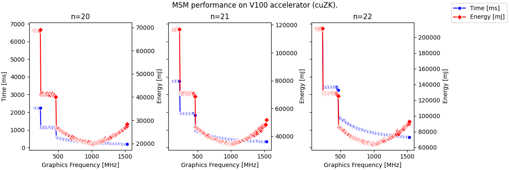

# cuZK: An Efficient GPU Implemetation of zkSNARK

This library is an efficient GPU implemetation of zkSNARK. It contains source code of the paper **cuZK: Accelerating Zero-Knowledge Proof with A Faster Parallel Multi-Scalar Multiplication Algorithm on GPUs** published at TCHES 2023.

> Note: This fork improves reproducibility and scalability, as well as advanaced profiling including energy consumption. 

## License

This library is licensed under the Apache License Version 2.0 and MIT licenses.

## Requirements

The original experiments were accompolished in the following setup:

1. Ubuntu 20.04
2. CUDA 11.5
3. gcc 7.5.0
4. Nvidia V100 (32 GB)


## Build / Develop

I recommend to work under the appropriate [NVIDIA CUDA image](https://hub.docker.com/r/nvidia/cuda/tags) which contains building tools.
Check the [compatibility of installed NVIDIA drivers](https://docs.nvidia.com/deploy/cuda-compatibility/#abstract).

Start the container mounting the working directory with the github source code:
```console
docker run -d \
   -it \
   --name nvidia-cuda \
   --runtime=nvidia \
   --mount type=bind,source=$(pwd),target=/home \
   --privileged \
   nvidia/cuda:11.7.1-devel-ubuntu20.04
```
Inside the running container, install `git` and `libgmp3-dev`:
```console
apt-get update
apt-get install -y git libgmp3-dev
```
Within the `cuZK/test` directory, adjust the compilation scope in the headers of `Makefile`:
```Makefile
# cuZK/test/Makefile
all: msma msmb  # limit the compilation scope to selected files
```
and then run `make` (it will take a while!)
```console
root@7816e1643c2a:/home/cuZK/test# make
```

> NOTE:  See also more on [compute capability](https://docs.nvidia.com/cuda/cuda-c-programming-guide/index.html#compute-capability) in [the documentation](https://developer.nvidia.com/cuda-gpus#compute).

> NOTE: The original code reserves too much of RAM. This can be adjusted inside the function `multi_init_params`.

## Profiling

Advanced profiling can be done with [NVIDIA Management Library](https://developer.nvidia.com/nvidia-management-library-nvml). 
The querying API should be used around the code piece of interest; the example below measures the energy consumption:
```cpp
   nvmlInit();
   unsigned long long energy_start, energy_end, energy_elapsed;
   nvmlDeviceGetTotalEnergyConsumption(device, &energy_start);
   // code to profile ...
   nvmlDeviceGetTotalEnergyConsumption(device, &energy_end);
   energy_elapsed = energy_end - energy_start;
   nvmlShutdown();
```
The `nvml` library should be included in the source code with `#include <nvml.h>` and linked at compilation time with `-l nvidia-ml` option.

Performance depends on the clock frequency; the range of allowed frequencies can be checked with `nvidia-smi -q -d SUPPORTED_CLOCKS`
and the memory/graphics clocks can be adjusted with `nvidia-smi -ac $mem,$freq`. See the [script profiling the MSM algorithm under a range of frequencies](./test/energy_benchmark.sh). Here are results obtained on Tesla V100-SXM2-16GB:




## Run Original Code

To run a test of an MSM of `2^20` scale and EC points on the BLS12-381 curve, run:
```
## (It will take some time to run for the first time.)
./msmtestb 20 
```

To run a test of Groth protocol with `2^20` constraint scales and EC points on the BLS12-381 curve, run:
```
## (It will take some time to run for the first time.)
./testb 20
```

For EC points on the ALT_BN128 curve and MNT4, run:
```
## ALT_BN128
./msmtesta 20
./testb 20

## MNT4
./msmtestm 20
./testm 20
```

In addition, our BLS12-377 carve implementation has a Rust binding with the template from [Sppark](https://github.com/supranational/sppark) developed by Supranational LLC. To install the latest version of Rust, first install rustup. Once rustup is installed, install the Rust toolchain by invoking:

```
curl --proto '=https' --tlsv1.2 -sSf https://sh.rustup.rs | sh
rustup install stable
```

To test BLS12-377 carve implementation.
```
cd test/BLS377
cargo bench
```

## Original Rusults

Here are a selection of the results tested under NVIDIA V100 GPU card with BLS12-381 curve. More results can be found in the paper cuZK.

For MSM computation, 

| Scale        | [Bellperson](https://github.com/filecoin-project/bellperson)| cuZK     |  Speedup |
| :---:        | :-----:                                                     | :-----:  |:-----:   |
| 2^19         | 0.23 s                                                      |  0.12    | 2.08x    |
| 2^20         | 0.41 s                                                      |  0.19    | 2.18x    |
| 2^21         | 0.73 s                                                      |  0.33    | 2.20x    |
| 2^22         | 1.30 s                                                      |  0.58    | 2.25x    |
| 2^23         | 2.64 s                                                      |  1.15    | 2.29x    |

For Groth's protocol, 

| Scale        | [Bellperson](https://github.com/filecoin-project/bellperson)| cuZK     |  Speedup |
| :---:        | :-----:                                                     | :-----:  |:-----:   |
| 2^19         | 2.62 s                                                      |  0.98    | 2.67x    |
| 2^20         | 4.45 s                                                      |  1.68    | 2.65x    |
| 2^21         | 7.96 s                                                      |  2.76    | 2.88x    |
| 2^22         | 14.20 s                                                     |  5.08    | 2.80x    |
| 2^23         | 29.13 s                                                     |  9.91    | 2.94x    |
